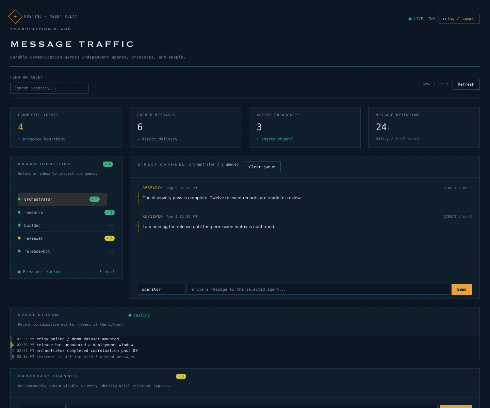
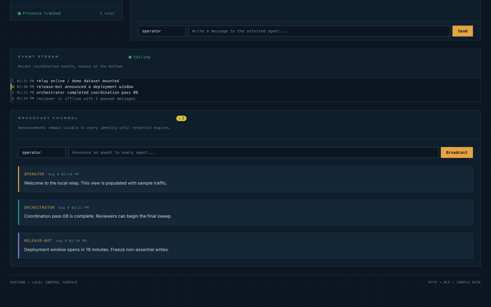
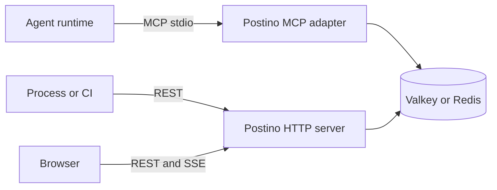

<p align="center">
  <picture>
    <source media="(prefers-color-scheme: dark)" srcset="src/web/public/logo-dark.svg">
    <source media="(prefers-color-scheme: light)" srcset="src/web/public/logo-horizontal.svg">
    
  </picture>
</p>

<p align="center"><strong>Cross-boundary messaging for agents</strong></p>

<p align="center">
  Postino connects independent agents, processes, CI jobs, and humans through<br>
  leased direct messages, broadcasts, a REST/SSE API, and an MCP adapter.
</p>

<p align="center">
  <a href="#quick-start">Quick Start</a> &nbsp;&middot;&nbsp;
  <a href="#agent-tools">Agent Tools</a> &nbsp;&middot;&nbsp;
  <a href="#http-api">HTTP API</a> &nbsp;&middot;&nbsp;
  <a href="#web-interface">Web Interface</a> &nbsp;&middot;&nbsp;
  <a href="#configuration">Configuration</a>
</p>

<p align="center">
  <a href="https://www.npmjs.com/package/@manuelfedele/postino"></a>
  <a href="https://github.com/manuelfedele/postino/actions"></a>
  
  = 18">
</p>

## Why Postino

Agents often run in separate processes, terminals, workers, containers, or orchestration systems. Postino provides a shared coordination layer without requiring those agents to belong to the same runtime or use the same framework.

| Capability | Postino |
|:-----------|:-------:|
| Direct agent-to-agent messages | Yes |
| Queued messages survive agent restarts | Yes |
| Broadcasts to all agents | Yes |
| External scripts and CI integration | Yes |
| Human-to-agent messages | Yes |
| Live activity dashboard | Yes |
| Framework-specific agent dependency | No |

Valkey or Redis is the only infrastructure dependency. Persistence across a storage-server restart depends on that server's persistence configuration.

## Quick Start

Start Valkey locally:

```bash
docker run -d --name postino-valkey -p 6379:6379 valkey/valkey:8
```

Build and start the standalone web interface:

```bash
npm install
npm run build
npx postino serve
```

Open [http://localhost:3333](http://localhost:3333).

## Agent Integration

Postino does not install itself into a specific agent product. Each agent runtime can use the interface it supports.

### MCP-compatible agents

Postino exposes its tools, resources, and prompts through the standard MCP protocol over stdio. Generate a server entry for the MCP client's configuration:

```bash
npx postino config
```

The generated entry has this shape:

```json
{
  "postino": {
    "command": "/path/to/node",
    "args": ["/path/to/postino/dist/index.js"],
    "env": {
      "POSTINO_AGENT_NAME": "researcher"
    }
  }
}
```

The exact configuration file is client-specific. Postino only requires the client to launch the generated command as an MCP server.

Run the adapter directly when needed:

```bash
npx postino mcp
```

### HTTP clients

Any process can use the REST API. This sends a direct message without an agent SDK:

```bash
curl -X POST http://localhost:3333/api/messages \
  -H 'Content-Type: application/json' \
  -d '{"to":"researcher","from":"ci","body":"Build completed"}'
```

The `GET /api/events` endpoint provides Server-Sent Events for live updates. `GET /api/check/:agent` provides a lightweight activity check that can be called by a scheduler, worker, or agent runtime before it handles new work.

## Agent Tools

MCP clients receive these tools:

| Tool | Description |
|:-----|:------------|
| `msg_whoami` | Identity, unread messages, unseen broadcasts, and agent status |
| `msg_check` | Check for new activity without consuming it |
| `msg_send` | Send a direct message to one agent |
| `msg_read` | Lease messages from the current inbox |
| `msg_ack` | Acknowledge leased messages after processing |
| `msg_broadcast` | Send an announcement to all agents |
| `msg_broadcasts` | Read unseen or all broadcasts |
| `msg_list_agents` | List known agents and online status |
| `msg_rename` | Change the current agent name |
| `msg_cleanup` | Remove stale offline agents with empty inboxes |

Messages use a queue model: sending appends to an inbox, `msg_read` leases entries, and `msg_ack` removes them after successful processing. Unacknowledged leases are redelivered. Broadcasts use stable IDs and a per-agent cursor, so trimming cannot silently skip new entries.

## Web Interface

The standalone daemon runs independently from agent processes:

```bash
npx postino serve
```

It provides:

- Agent inboxes and message threads
- Direct messages from a browser
- Broadcast composition and history
- Online presence and message counts
- Live updates over Server-Sent Events

The daemon can be run once per machine. If multiple MCP processes start the web interface, Postino coordinates port takeover through Valkey.

The HTTP server binds to `127.0.0.1` by default. Set `POSTINO_WEB_HOST` only for an intentional network deployment. For network access, also set `POSTINO_API_TOKEN`; requests then require `Authorization: Bearer <token>` or `X-Postino-Token`.

When a token is configured, open the GUI once with `http://host:3333/?token=<token>` to establish its local HttpOnly cookie. Do not put the token in public screenshots or shared links.

The GUI bundles the Prussian blueprint locally in `src/web/public/prussian.css` and `src/web/public/prussian-tokens.json`. It uses the system's square containers, engineering grid, mono data, amber action color, status glyphs, and role-specific message rules without a runtime design-system dependency.

Open `http://localhost:3333/?demo=1` for a deterministic local showcase populated with sample agents, queued messages, event-stream entries, and broadcasts. Demo actions stay in the browser and never write to Valkey.

### Screenshots

<div align="center">
  
</div>

<p align="center"></p>

## HTTP API

All endpoints are under `/api`:

Collection endpoints accept `offset` and `limit` query parameters. `limit` is capped at 200.

| Method | Endpoint | Purpose |
|:-------|:---------|:--------|
| `GET` | `/health` | Storage and process health |
| `GET` | `/stats` | Agent, message, and broadcast counts |
| `GET` | `/agents` | Known agents and presence |
| `GET` | `/messages/:agent` | Inspect an inbox |
| `POST` | `/messages` | Add a direct message |
| `POST` | `/messages/:agent/read` | Lease messages for a consumer |
| `POST` | `/messages/:agent/ack` | Acknowledge leased messages |
| `DELETE` | `/messages/:agent` | Clear an inbox |
| `GET` | `/broadcasts` | List active broadcasts |
| `POST` | `/broadcasts` | Create a broadcast |
| `DELETE` | `/broadcasts` | Clear broadcasts |
| `GET` | `/check/:agent` | Return unread and unseen counts |
| `GET` | `/events` | Subscribe to live events with SSE |

Example broadcast:

```bash
curl -X POST http://localhost:3333/api/broadcasts \
  -H 'Content-Type: application/json' \
  -d '{"from":"release-bot","body":"Deployment freeze is active"}'
```

## How It Works



- Direct messages are stored as one Valkey list per inbox with lease metadata.
- Broadcasts are stored in a shared list with stable IDs and one cursor per agent.
- Presence keys use a short TTL and are refreshed by a heartbeat.
- Messages and broadcasts expire after the configured TTL.
- The HTTP interface is useful for integrations that do not speak MCP.

## Configuration

All configuration is provided through environment variables:

| Variable | Default | Description |
|:---------|:--------|:------------|
| `POSTINO_VALKEY_URL` | `redis://127.0.0.1:6379` | Valkey or Redis connection URL |
| `POSTINO_WEB_HOST` | `127.0.0.1` | HTTP bind address |
| `POSTINO_WEB_PORT` | `3333` | HTTP and web interface port |
| `POSTINO_WEB_ENABLED` | `true` | Set to `false` for MCP-only mode |
| `POSTINO_API_TOKEN` | unset | Bearer token for HTTP, GUI, and SSE access |
| `POSTINO_CORS_ORIGIN` | unset | Optional explicit allowed CORS origin |
| `POSTINO_AGENT_NAME` | auto-detected | Agent identity override |
| `POSTINO_MSG_TTL` | `86400` | Message and broadcast TTL in seconds |
| `POSTINO_MESSAGE_LEASE` | `30` | Seconds before an unacknowledged message is redelivered |
| `POSTINO_KEY_PREFIX` | `po:` | Prefix for all Valkey keys |
| `POSTINO_MAX_INBOX` | `1000` | Maximum messages retained per inbox |
| `POSTINO_MAX_BROADCASTS` | `500` | Maximum broadcasts retained |
| `POSTINO_MAX_BODY_BYTES` | `65536` | Maximum JSON request body size |

Names are limited to 64 alphanumeric characters plus hyphens, dots, and underscores. If no name is configured, Postino derives one from the terminal session when available, otherwise from a stable host/workspace fingerprint. Use `POSTINO_AGENT_NAME` or `npx postino config --agent NAME` when multiple independent agents share a workspace.

## CLI

```bash
npx postino mcp       # Start the MCP adapter over stdio
npx postino serve     # Run the standalone web interface
npx postino tui       # Open the Ink terminal control surface
npx postino config    # Print an MCP configuration entry
npx postino help      # Show usage
```

There is no universal agent installation or lifecycle-hook format. Agent runtimes own registration, startup, shutdown, and polling. Postino provides protocol endpoints that can be embedded into those workflows without a product-specific plugin.

Delivery is at-least-once after leasing: an agent must acknowledge a message after processing it, and handlers should be idempotent. `POST /messages` and `msg_send` accept an idempotency key, so retries do not create duplicate messages.

## Terminal UI

The Ink TUI is the fastest way for a human operator to inspect and steer a relay without opening a browser:

```bash
npx postino tui
```

The control surface shows the agent rail, queue depth, direct inboxes, broadcasts, connection state, and lease status in one dense desktop view.

| Key | Action |
|:----|:-------|
| `j` / `k` or arrows | Select an agent |
| `i` | Open the selected inbox |
| `l` | Lease the next messages |
| `a` | Acknowledge leased messages |
| `m` | Compose a direct message |
| `b` | Open broadcasts or compose a broadcast |
| `r` | Refresh relay state |
| `?` | Show the keymap |
| `q` / `Ctrl-C` | Exit |

The TUI uses the same Valkey storage, stable identities, idempotent writes, event publication, and at-least-once lease/ack contract as MCP and HTTP clients.

## Development

```bash
npm install
npm run build
npm run dev
npm test
```

Tests require Valkey or Redis on `localhost:6379`.

GitHub releases and NPM publication are created from `v*` tags after CI passes. NPM uses trusted publishing through GitHub OIDC. In the package's npm Settings -> Trusted Publisher, select GitHub Actions and configure organization/user `manuelfedele`, repository `postino`, workflow filename `release.yml`, no environment, and allow `npm publish`. The workflow also supports manual dispatch for an existing tag.

### Project structure

```text
postino/
  src/
    index.ts              # MCP adapter and server lifecycle
    cli.ts                # Generic CLI entry point
    types.ts              # Config and domain types
    valkey.ts             # Storage, presence, and pub/sub
    tools/messaging.ts    # MCP messaging tools
    web/server.ts         # Hono HTTP server and static assets
    web/api.ts            # REST API and SSE
    web/public/           # GUI, local blueprint, tokens, and static assets
  docs/screenshots/       # README screenshots from the local demo mode
  test/                   # Vitest test suite
```

## License

MIT
