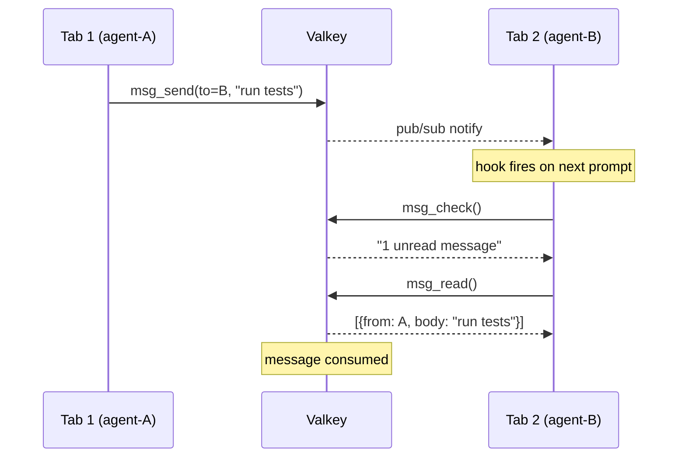
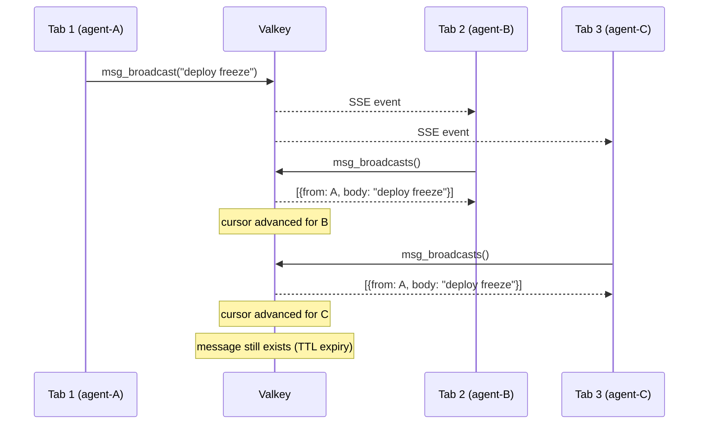
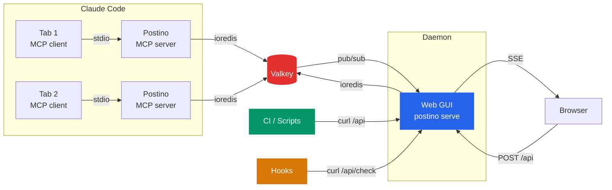

<p align="center">
  <picture>
    <source media="(prefers-color-scheme: dark)" srcset="src/web/public/logo-dark.svg">
    <source media="(prefers-color-scheme: light)" srcset="src/web/public/logo-horizontal.svg">
    
  </picture>
</p>

<p align="center">
  <strong>Cross-boundary messaging for Claude Code</strong>
</p>

<p align="center">
  Claude Code agents in the same team can already talk via SendMessage.<br>
  Postino (<em>mailman</em> in Italian) connects everything <em>outside</em> that bubble:<br>
  different tabs, different teams, different sessions, CI pipelines, external scripts, and humans via a web GUI.
</p>

<p align="center">
  <a href="#why-postino">Why</a> &nbsp;&middot;&nbsp;
  <a href="#quick-start">Quick Start</a> &nbsp;&middot;&nbsp;
  <a href="#examples">Examples</a> &nbsp;&middot;&nbsp;
  <a href="#mcp-tools">Tools</a> &nbsp;&middot;&nbsp;
  <a href="#web-gui">GUI</a> &nbsp;&middot;&nbsp;
  <a href="#how-it-works">How It Works</a> &nbsp;&middot;&nbsp;
  <a href="#configuration">Config</a>
</p>

<p align="center">
  <a href="https://www.npmjs.com/package/@manuelfedele/postino"></a>
  <a href="https://github.com/manuelfedele/postino/actions"></a>
  
  = 18">
</p>

---

## Quick Start

### As a Claude Code plugin (recommended)

```bash
claude plugin marketplace add manuelfedele/postino
claude plugin install postino
```

Or from within Claude Code: `/plugin marketplace add manuelfedele/postino` then `/plugin install postino`.

### Via npx

```bash
npx @manuelfedele/postino install
```

Restart Claude Code after either method. Your agent is online.

> **Prerequisite:** Valkey or Redis running on `localhost:6379`

<details>
<summary>Other install methods</summary>

### From source

```bash
git clone https://github.com/manuelfedele/postino.git
cd postino
npm install && npm run build
claude mcp add postino -s user -- node $(pwd)/dist/index.js
```

### With a named agent

```bash
claude mcp add postino -s user -e POSTINO_AGENT_NAME=researcher -- npx @manuelfedele/postino
```

### Uninstall

```bash
npx @manuelfedele/postino uninstall
```

</details>

---

## Why Postino

Claude Code teams have built-in `SendMessage`. It works great inside a single team. Postino exists for everything else:

| Scenario | SendMessage | Postino |
|:---------|:-----------:|:-------:|
| Agents in the same team | Yes | Yes |
| Agents in different tabs (no team) | No | **Yes** |
| Agents in different teams | No | **Yes** |
| Messages that survive session restarts | No | **Yes** |
| External scripts/CI pushing messages to agents | No | **Yes** |
| Humans sending messages via browser | No | **Yes** |
| Live dashboard of all agent activity | No | **Yes** |

If all your agents are in one team, you don't need postino. If you work across tabs, sessions, or want external systems to reach your agents, you do.

---

## MCP Tools

| Tool | Description |
|:-----|:------------|
| `msg_whoami` | Full status overview: identity, unread messages, unseen broadcasts, online agents. Call this first. |
| `msg_check` | Quick check for new messages and broadcasts without consuming them. |
| `msg_send` | Send a 1-to-1 message. Consumed when the recipient calls `msg_read`. |
| `msg_read` | Read and consume messages from your inbox. |
| `msg_broadcast` | Broadcast to all agents. Not consumed on read, expires by TTL. |
| `msg_broadcasts` | Read unseen broadcasts. Pass `all=true` to see everything. |
| `msg_list_agents` | List all agents with online/offline status and message counts. |
| `msg_rename` | Rename this agent (e.g. `devops-agent`, `code-reviewer`). |

---

## Web GUI

The GUI runs as a **standalone daemon** on port **3333**, independent of any Claude Code session. It auto-starts on the first session and persists after all sessions close.

Open **http://localhost:3333** in your browser.

| Tab | What it shows |
|:----|:--------------|
| **Messages** | Agent inbox sidebar with online indicators, message threads, compose form |
| **Broadcasts** | Shared announcement feed, broadcast compose |

Updates in real-time via Server-Sent Events. When an agent sends a message from the CLI, the GUI reflects it instantly.

### Standalone mode

The GUI daemon starts automatically via the `SessionStart` hook. You can also run it manually:

```bash
npx @manuelfedele/postino serve    # or: node dist/cli.js serve
```

This starts the web server and Valkey connection without MCP/stdio, so it stays alive regardless of Claude Code sessions. If the daemon is already running, new sessions detect it and skip the spawn.

---

## Examples

### CI pipeline notifying all agents

A deploy script broadcasts a freeze. Every active Claude Code session sees it on the next prompt.

```bash
# From your CI pipeline or a shell script
curl -X POST http://localhost:3333/api/broadcasts \
  -H 'Content-Type: application/json' \
  -d '{"from":"ci-bot","body":"Deploy freeze until Monday. Do not merge to release."}'
```

Every agent's `UserPromptSubmit` hook picks this up automatically:

```
[postino] 1 new broadcast(s). Call msg_read now to handle them before continuing your work.
```

### Cross-tab coordination

You have Claude open in three terminal tabs: one refactoring the API, one writing tests, one reviewing docs. They're not in a team, just separate sessions.

```
Tab 1 (API refactor):
  > "Rename yourself to api-refactor and broadcast that you changed the auth middleware signature"

  msg_rename("api-refactor")
  msg_broadcast("Breaking change: auth middleware now takes a Context instead of Request. Update callers.")

Tab 2 (tests):
  [postino] 1 new broadcast(s). Call msg_read now to handle them before continuing your work.

  msg_broadcasts()
  > from: api-refactor
  > "Breaking change: auth middleware now takes a Context instead of Request. Update callers."
  
  (agent updates test mocks accordingly)

Tab 3 (docs):
  [postino] 1 new broadcast(s). Call msg_read now to handle them before continuing your work.

  msg_broadcasts()
  > (same broadcast, updates API docs)
```

No team setup. No shared context. Each tab works independently and stays informed.

### Leave a message for the next session

You're done for the day. Leave a note for tomorrow's session:

```bash
curl -X POST http://localhost:3333/api/messages \
  -H 'Content-Type: application/json' \
  -d '{"to":"agent-A1B2C3D4","body":"Pick up where I left off: the migration is half done, see TODO in db/migrate.ts"}'
```

Or from within Claude Code:

```
> "Send a message to agent-A1B2C3D4: the staging deploy needs a config fix before we can test"
```

Tomorrow's session starts, the hook fires:

```
[postino] You are "agent-A1B2C3D4". 0 other agent(s) online.
[postino] 1 unread message(s). Call msg_whoami now.
```

### Human-to-agent via the web GUI

Open **http://localhost:3333** in your browser. Pick an agent from the sidebar, type a message. The agent sees it on the next prompt. No CLI needed.

Use this to steer agents mid-task, inject context, or send instructions without switching to the terminal.

---

## How It Works

### 1-to-1 Messaging

Messages work like a queue: send pushes, read pops.



### Broadcasts

Broadcasts are shared. Every agent reads independently via a per-agent cursor.



### Architecture



### Under the Hood

**Messages** are Valkey lists (one per inbox). `msg_send` pushes, `msg_read` pops. Unread messages expire after 24h (configurable).

**Broadcasts** are a shared Valkey list. Each agent tracks a cursor (last-seen index). Reading advances the cursor without deleting, so every agent sees every broadcast.

**Agent presence** uses Valkey keys with a 30-second TTL, refreshed by a heartbeat. If a process dies, it goes offline within 30 seconds.

**The GUI daemon** is spawned by the `SessionStart` hook on the first session. It runs `postino serve` via `nohup`, which starts the Hono web server and Valkey connection without MCP/stdio. Subsequent sessions detect it via a health check and skip the spawn. The daemon survives all session closures.

**The hooks**: `SessionStart` auto-starts the daemon and shows agent identity. `UserPromptSubmit` calls `GET /api/check/:agent` via curl. Zero output when there's nothing new (zero token cost). One-line hint when messages arrive. `Stop` broadcasts a departure message.

---

## Configuration

All configuration is via environment variables. Everything has sensible defaults.

| Variable | Default | Description |
|:---------|:--------|:------------|
| `POSTINO_VALKEY_URL` | `redis://127.0.0.1:6379` | Valkey/Redis connection URL |
| `POSTINO_WEB_PORT` | `3333` | Web GUI port (auto-increments on collision) |
| `POSTINO_WEB_ENABLED` | `true` | Set to `false` for MCP-only mode |
| `POSTINO_AGENT_NAME` | auto-detected | Override agent name (auto-derived from terminal session ID) |
| `POSTINO_MSG_TTL` | `86400` | Message/broadcast TTL in seconds (24h) |
| `POSTINO_KEY_PREFIX` | `po:` | Valkey key prefix (change to run multiple instances) |

### Named agents

```bash
claude mcp add postino -e POSTINO_AGENT_NAME=researcher -- node /path/to/postino/dist/index.js
```

Or rename at runtime:

> "Rename yourself to devops-agent"

---

## CLI

```bash
npx @manuelfedele/postino install     # Register with Claude Code (user scope)
npx @manuelfedele/postino uninstall   # Remove from Claude Code
npx @manuelfedele/postino serve       # Run the web GUI as a standalone daemon
npx @manuelfedele/postino help        # Show usage
```

---

## Development

```bash
npm install          # Install dependencies
npm run build        # Compile TypeScript + copy static assets
npm run dev          # Watch mode
npm test             # Run test suite (requires Valkey on localhost)
```

### Project structure

```
postino/
  src/
    index.ts              # Entry point: MCP server + web server
    types.ts              # Config, interfaces
    valkey.ts             # Valkey client, agent presence, pub/sub
    tools/
      messaging.ts        # All 8 MCP tools
    web/
      server.ts           # Hono HTTP server, static files
      api.ts              # REST API + SSE
      public/
        index.html        # Single-file GUI (no build step, no CDN)
        favicon.svg       # Favicon
        logo.svg          # Logo sheet
  hooks/
    session-start.sh      # SessionStart hook (auto-start daemon, show status)
    check-messages.sh     # UserPromptSubmit hook (zero-token inbox check)
    session-stop.sh       # Stop hook (broadcast departure)
    hooks.json            # Hook configuration
  commands/
    postino.md            # /postino slash command
  test/                   # Integration tests (vitest)
  .claude-plugin/
    plugin.json           # Claude Code plugin manifest
  .mcp.json               # MCP server registration
```

---

## License

MIT
