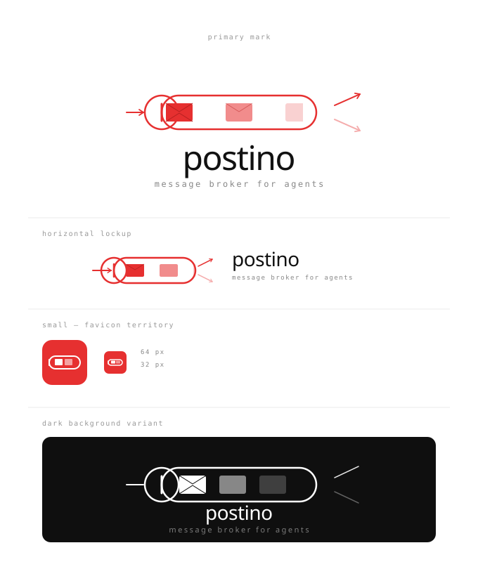

<p align="center">
  
</p>

<p align="center">
  <strong>Message broker for Claude Code agents</strong>
</p>

<p align="center">
  Working with Claude in multiple tabs and sharing context between agents can be painful.<br>
  Postino (<em>mailman</em> in Italian) gives your agents a way to talk to each other.
</p>

<p align="center">
  <a href="#features">Features</a> &nbsp;&middot;&nbsp;
  <a href="#quick-start">Quick Start</a> &nbsp;&middot;&nbsp;
  <a href="#mcp-tools">Tools</a> &nbsp;&middot;&nbsp;
  <a href="#web-gui">GUI</a> &nbsp;&middot;&nbsp;
  <a href="#how-it-works">How It Works</a> &nbsp;&middot;&nbsp;
  <a href="#configuration">Config</a>
</p>

<p align="center">
  
  = 18">
  
</p>

---

## Features

**1-to-1 Messaging** &mdash; Send messages to specific agents. Messages are consumed on read, like a work queue. No duplicates, no stale data.

**Broadcasts** &mdash; Announce to all agents at once. Every agent sees broadcasts independently. They expire by TTL, not by reading.

**Agent Discovery** &mdash; Agents auto-register with unique identities derived from the terminal session. See who's online, who has unread messages.

**Agent Rename** &mdash; Agents can rename themselves to meaningful names like `devops-agent` or `reviewer`. The name propagates instantly.

**Real-time Web GUI** &mdash; Browse inboxes, send messages, view broadcasts. Updates live via SSE. Works offline (no CDN dependencies).

**Zero Config** &mdash; Each Claude Code tab gets a unique agent name automatically. No setup required beyond having Valkey/Redis running.

**Smart Hooks** &mdash; A `UserPromptSubmit` hook checks for new messages before each prompt. Silent when there's nothing new (zero token cost). Alerts Claude when messages arrive.

---

## Quick Start

### Prerequisites

- **Node.js** >= 18
- **Valkey** or **Redis** running on `localhost:6379`

### Install

```bash
git clone https://github.com/manuelfedele/postino.git
cd postino
npm install
npm run build
```

### Register with Claude Code

```bash
claude mcp add postino -- node /absolute/path/to/postino/dist/index.js
```

Restart Claude Code. Done. Your agent is online.

### Try it

Open two Claude Code tabs in the same project. In tab 1:

> "Send a message to the other agent saying the migration is done"

In tab 2:

> "Check my messages"

---

## MCP Tools

| Tool | Description |
|:-----|:------------|
| `msg_whoami` | Full status overview: identity, unread messages, unseen broadcasts, online agents. Call this first. |
| `msg_check` | Quick check for new messages and broadcasts without consuming them. |
| `msg_send` | Send a 1-to-1 message. Consumed when the recipient calls `msg_read`. |
| `msg_read` | Read and consume messages from your inbox. |
| `msg_broadcast` | Broadcast to all agents. Not consumed on read, expires by TTL. |
| `msg_broadcasts` | Read unseen broadcasts. Pass `all=true` to see everything. |
| `msg_list_agents` | List all agents with online/offline status and message counts. |
| `msg_rename` | Rename this agent (e.g. `devops-agent`, `code-reviewer`). |

---

## Web GUI

The GUI starts automatically alongside the MCP server on port **3333**.  
If the port is in use, it auto-increments (3334, 3335, ...).

Open **http://localhost:3333** in your browser.

| Tab | What it shows |
|:----|:--------------|
| **Messages** | Agent inbox sidebar with online indicators, message threads, compose form |
| **Broadcasts** | Shared announcement feed, broadcast compose |

Updates in real-time via Server-Sent Events. When an agent sends a message from the CLI, the GUI reflects it instantly.

---

## How It Works

```
Tab 1 (agent-A)                    Valkey                     Tab 2 (agent-B)
     |                               |                              |
     |-- msg_send(to=B, "do X") ---->|                              |
     |                               |-- pub/sub notify ----------->|
     |                               |                              |-- msg_check()
     |                               |                              |   "1 unread message"
     |                               |                              |-- msg_read()
     |                               |<-- consume --------------------|   [{from: A, body: "do X"}]
     |                               |                              |
     |-- msg_broadcast("deploy") --->|-- shared list -------------->|
     |                               |                              |-- msg_broadcasts()
     |                               |                              |   [{from: A, body: "deploy"}]
```

**Messages** are Valkey lists (one per agent inbox). `msg_send` pushes, `msg_read` pops. Messages have a 24h TTL as a safety net for unread messages.

**Broadcasts** are a shared Valkey list. Each agent tracks a cursor (last-seen index). Reading broadcasts advances the cursor without deleting the data, so every agent sees every broadcast.

**Agent presence** uses Valkey keys with a 30-second TTL, refreshed by a heartbeat. If a process dies, it goes offline within 30 seconds.

**The hook** (`UserPromptSubmit`) calls `GET /api/check/:agent` via curl. If there are no new messages or broadcasts, it outputs nothing (zero tokens). If there's something new, it injects a one-line hint so Claude knows to check.

---

## Configuration

All configuration is via environment variables. Everything has sensible defaults.

| Variable | Default | Description |
|:---------|:--------|:------------|
| `POSTINO_VALKEY_URL` | `redis://127.0.0.1:6379` | Valkey/Redis connection URL |
| `POSTINO_WEB_PORT` | `3333` | Web GUI port (auto-increments on collision) |
| `POSTINO_WEB_ENABLED` | `true` | Set to `false` for MCP-only mode |
| `POSTINO_AGENT_NAME` | auto-detected | Override agent name (auto-derived from terminal session ID) |
| `POSTINO_MSG_TTL` | `86400` | Message/broadcast TTL in seconds (24h) |
| `POSTINO_KEY_PREFIX` | `po:` | Valkey key prefix (change to run multiple instances) |

### Named agents

```bash
claude mcp add postino -e POSTINO_AGENT_NAME=researcher -- node /path/to/postino/dist/index.js
```

Or rename at runtime:

> "Rename yourself to devops-agent"

---

## Development

```bash
npm install          # Install dependencies
npm run build        # Compile TypeScript + copy static assets
npm run dev          # Watch mode
npm test             # Run test suite (requires Valkey on localhost)
```

### Project structure

```
postino/
  src/
    index.ts              # Entry point: MCP server + web server
    types.ts              # Config, interfaces
    valkey.ts             # Valkey client, agent presence, pub/sub
    tools/
      messaging.ts        # All 8 MCP tools
    web/
      server.ts           # Hono HTTP server, static files
      api.ts              # REST API + SSE
      public/
        index.html        # Single-file GUI (no build step, no CDN)
        favicon.svg       # Favicon
        logo.svg          # Logo sheet
  hooks/
    check-messages.sh     # UserPromptSubmit hook (zero-token check)
    hooks.json            # Hook configuration
  commands/
    postino.md            # /postino slash command
  test/                   # Integration tests (vitest)
  .claude-plugin/
    plugin.json           # Claude Code plugin manifest
  .mcp.json               # MCP server registration
```

---

## License

MIT
