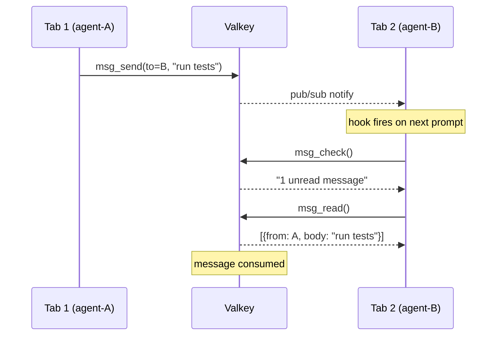
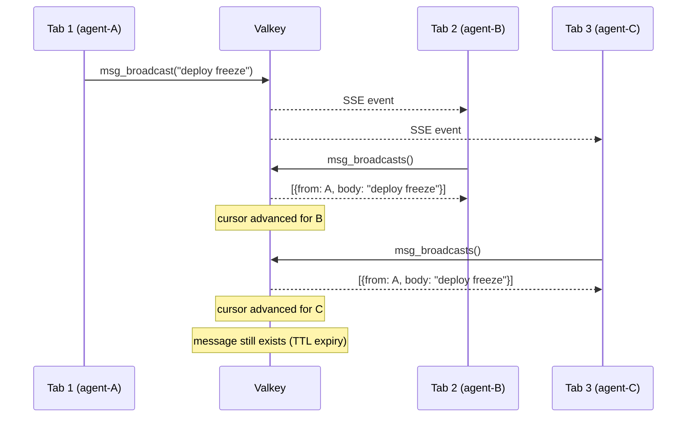
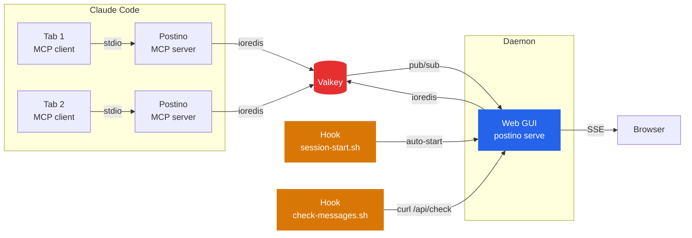

<p align="center">
  <picture>
    <source media="(prefers-color-scheme: dark)" srcset="src/web/public/logo-dark.svg">
    <source media="(prefers-color-scheme: light)" srcset="src/web/public/logo-horizontal.svg">
    
  </picture>
</p>

<p align="center">
  <strong>Message broker for Claude Code agents</strong>
</p>

<p align="center">
  Working with Claude in multiple tabs and sharing context between agents can be painful.<br>
  Postino (<em>mailman</em> in Italian) gives your agents a way to talk to each other.
</p>

<p align="center">
  <a href="#features">Features</a> &nbsp;&middot;&nbsp;
  <a href="#quick-start">Quick Start</a> &nbsp;&middot;&nbsp;
  <a href="#mcp-tools">Tools</a> &nbsp;&middot;&nbsp;
  <a href="#agent-teams-example">Teams</a> &nbsp;&middot;&nbsp;
  <a href="#web-gui">GUI</a> &nbsp;&middot;&nbsp;
  <a href="#how-it-works">How It Works</a> &nbsp;&middot;&nbsp;
  <a href="#configuration">Config</a>
</p>

<p align="center">
  <a href="https://www.npmjs.com/package/@manuelfedele/postino"></a>
  <a href="https://github.com/manuelfedele/postino/actions"></a>
  
  = 18">
</p>

---

## Quick Start

### As a Claude Code plugin (recommended)

```bash
claude plugin marketplace add manuelfedele/postino
claude plugin install postino
```

Or from within Claude Code: `/plugin marketplace add manuelfedele/postino` then `/plugin install postino`.

### Via npx

```bash
npx @manuelfedele/postino install
```

Restart Claude Code after either method. Your agent is online.

> **Prerequisite:** Valkey or Redis running on `localhost:6379`

<details>
<summary>Other install methods</summary>

### From source

```bash
git clone https://github.com/manuelfedele/postino.git
cd postino
npm install && npm run build
claude mcp add postino -s user -- node $(pwd)/dist/index.js
```

### With a named agent

```bash
claude mcp add postino -s user -e POSTINO_AGENT_NAME=researcher -- npx @manuelfedele/postino
```

### Uninstall

```bash
npx @manuelfedele/postino uninstall
```

</details>

---

## Features

**1-to-1 Messaging** &mdash; Send messages to specific agents. Messages are consumed on read, like a work queue. No duplicates, no stale data.

**Broadcasts** &mdash; Announce to all agents at once. Every agent sees broadcasts independently. They expire by TTL, not by reading.

**Agent Discovery** &mdash; Agents auto-register with unique identities derived from the terminal session. See who's online, who has unread messages.

**Agent Rename** &mdash; Agents can rename themselves to meaningful names like `devops-agent` or `reviewer`. The name propagates instantly.

**Real-time Web GUI** &mdash; Browse inboxes, send messages, view broadcasts. Updates live via SSE. Works offline (no CDN dependencies).

**Zero Config** &mdash; Each Claude Code tab gets a unique agent name automatically. No setup required beyond having Valkey/Redis running.

**Smart Hooks** &mdash; A `UserPromptSubmit` hook checks for new messages before each prompt. Silent when there's nothing new (zero token cost). Alerts Claude when messages arrive.

**Persistent GUI Daemon** &mdash; The web GUI runs as a standalone process, auto-started on the first session. It stays alive after all Claude Code sessions close, so you always have a dashboard.

---

## MCP Tools

| Tool | Description |
|:-----|:------------|
| `msg_whoami` | Full status overview: identity, unread messages, unseen broadcasts, online agents. Call this first. |
| `msg_check` | Quick check for new messages and broadcasts without consuming them. |
| `msg_send` | Send a 1-to-1 message. Consumed when the recipient calls `msg_read`. |
| `msg_read` | Read and consume messages from your inbox. |
| `msg_broadcast` | Broadcast to all agents. Not consumed on read, expires by TTL. |
| `msg_broadcasts` | Read unseen broadcasts. Pass `all=true` to see everything. |
| `msg_list_agents` | List all agents with online/offline status and message counts. |
| `msg_rename` | Rename this agent (e.g. `devops-agent`, `code-reviewer`). |

---

## Web GUI

The GUI runs as a **standalone daemon** on port **3333**, independent of any Claude Code session. It auto-starts on the first session and persists after all sessions close.

Open **http://localhost:3333** in your browser.

| Tab | What it shows |
|:----|:--------------|
| **Messages** | Agent inbox sidebar with online indicators, message threads, compose form |
| **Broadcasts** | Shared announcement feed, broadcast compose |

Updates in real-time via Server-Sent Events. When an agent sends a message from the CLI, the GUI reflects it instantly.

### Standalone mode

The GUI daemon starts automatically via the `SessionStart` hook. You can also run it manually:

```bash
npx @manuelfedele/postino serve    # or: node dist/cli.js serve
```

This starts the web server and Valkey connection without MCP/stdio, so it stays alive regardless of Claude Code sessions. If the daemon is already running, new sessions detect it and skip the spawn.

---

## Agent Teams Example

Postino shines when Claude Code agents work as a team. Each teammate gets its own MCP server and Valkey connection, enabling direct messages and broadcasts across the team.

Here's a real session with two agents coordinating a code review:

```
You: "Spin up two agents to review the heartbeat TTL in valkey.ts"

┌─────────────────────────────────────────────────────────────────┐
│  agent-a                                                        │
│                                                                 │
│  1. msg_rename("agent-a")                                       │
│  2. msg_send(to="agent-b",                                      │
│       "Found a bug in src/valkey.ts line 55 -                   │
│        the heartbeat TTL should be 60 not 30. Can you review?") │
│  3. msg_broadcast("Team standup: agent-a is investigating       │
│       heartbeat TTL values")                                    │
│  4. msg_whoami()                                                │
│     > agent-b: online, 1 queued message                         │
└─────────────────────────────────────────────────────────────────┘

┌─────────────────────────────────────────────────────────────────┐
│  agent-b                                                        │
│                                                                 │
│  1. msg_rename("agent-b")                                       │
│  2. msg_whoami()                                                │
│     > 1 unread message, 1 unseen broadcast                     │
│  3. msg_read()                                                  │
│     > from: agent-a                                             │
│     > "Found a bug in src/valkey.ts line 55 -                   │
│        the heartbeat TTL should be 60 not 30. Can you review?"  │
│  4. msg_broadcasts()                                            │
│     > from: agent-a                                             │
│     > "Team standup: agent-a is investigating                   │
│        heartbeat TTL values"                                    │
│  5. msg_send(to="agent-a",                                      │
│       "Got it, I'll review the heartbeat TTL.                   │
│        Looks like 60s makes sense for production workloads.")   │
└─────────────────────────────────────────────────────────────────┘
```

Messages flow through Valkey in real time. Direct messages are consumed on read (work queue pattern), broadcasts persist for all agents. When agents shut down, they deregister and clean up automatically.

**What postino adds over built-in agent messaging:**

- **Cross-team / cross-session** &mdash; agents in different tabs or teams can message each other
- **Broadcasts** &mdash; one-to-many announcements without knowing recipients
- **Persistence** &mdash; messages survive agent restarts (TTL-based expiry)
- **Web GUI** &mdash; real-time monitoring at localhost:3333
- **Hooks** &mdash; automatic inbox check on every prompt, zero token cost via HTTP

---

## How It Works

### 1-to-1 Messaging

Messages work like a queue: send pushes, read pops.



### Broadcasts

Broadcasts are shared. Every agent reads independently via a per-agent cursor.



### Architecture



### Under the Hood

**Messages** are Valkey lists (one per inbox). `msg_send` pushes, `msg_read` pops. Unread messages expire after 24h (configurable).

**Broadcasts** are a shared Valkey list. Each agent tracks a cursor (last-seen index). Reading advances the cursor without deleting, so every agent sees every broadcast.

**Agent presence** uses Valkey keys with a 30-second TTL, refreshed by a heartbeat. If a process dies, it goes offline within 30 seconds.

**The GUI daemon** is spawned by the `SessionStart` hook on the first session. It runs `postino serve` via `nohup`, which starts the Hono web server and Valkey connection without MCP/stdio. Subsequent sessions detect it via a health check and skip the spawn. The daemon survives all session closures.

**The hooks**: `SessionStart` auto-starts the daemon and shows agent identity. `UserPromptSubmit` calls `GET /api/check/:agent` via curl. Zero output when there's nothing new (zero token cost). One-line hint when messages arrive. `Stop` broadcasts a departure message.

---

## Configuration

All configuration is via environment variables. Everything has sensible defaults.

| Variable | Default | Description |
|:---------|:--------|:------------|
| `POSTINO_VALKEY_URL` | `redis://127.0.0.1:6379` | Valkey/Redis connection URL |
| `POSTINO_WEB_PORT` | `3333` | Web GUI port (auto-increments on collision) |
| `POSTINO_WEB_ENABLED` | `true` | Set to `false` for MCP-only mode |
| `POSTINO_AGENT_NAME` | auto-detected | Override agent name (auto-derived from terminal session ID) |
| `POSTINO_MSG_TTL` | `86400` | Message/broadcast TTL in seconds (24h) |
| `POSTINO_KEY_PREFIX` | `po:` | Valkey key prefix (change to run multiple instances) |

### Named agents

```bash
claude mcp add postino -e POSTINO_AGENT_NAME=researcher -- node /path/to/postino/dist/index.js
```

Or rename at runtime:

> "Rename yourself to devops-agent"

---

## CLI

```bash
npx @manuelfedele/postino install     # Register with Claude Code (user scope)
npx @manuelfedele/postino uninstall   # Remove from Claude Code
npx @manuelfedele/postino serve       # Run the web GUI as a standalone daemon
npx @manuelfedele/postino help        # Show usage
```

---

## Development

```bash
npm install          # Install dependencies
npm run build        # Compile TypeScript + copy static assets
npm run dev          # Watch mode
npm test             # Run test suite (requires Valkey on localhost)
```

### Project structure

```
postino/
  src/
    index.ts              # Entry point: MCP server + web server
    types.ts              # Config, interfaces
    valkey.ts             # Valkey client, agent presence, pub/sub
    tools/
      messaging.ts        # All 8 MCP tools
    web/
      server.ts           # Hono HTTP server, static files
      api.ts              # REST API + SSE
      public/
        index.html        # Single-file GUI (no build step, no CDN)
        favicon.svg       # Favicon
        logo.svg          # Logo sheet
  hooks/
    session-start.sh      # SessionStart hook (auto-start daemon, show status)
    check-messages.sh     # UserPromptSubmit hook (zero-token inbox check)
    session-stop.sh       # Stop hook (broadcast departure)
    hooks.json            # Hook configuration
  commands/
    postino.md            # /postino slash command
  test/                   # Integration tests (vitest)
  .claude-plugin/
    plugin.json           # Claude Code plugin manifest
  .mcp.json               # MCP server registration
```

---

## License

MIT
